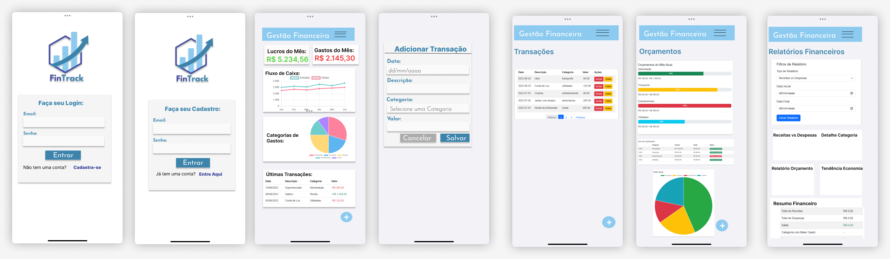
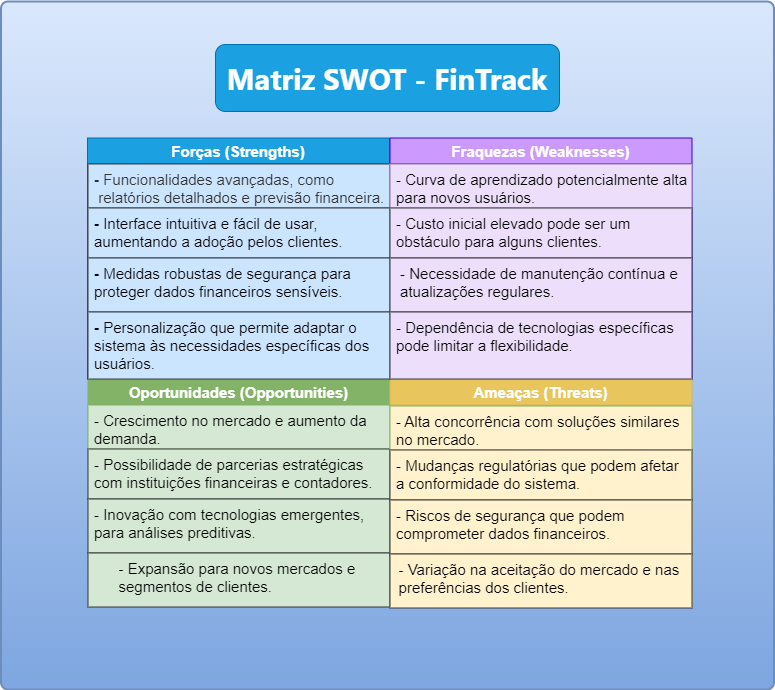

# FinTrack

FinTrack é um site e aplicativo de gestão financeira projetado para ajudar os usuários a acompanhar e gerenciar suas finanças pessoais de maneira eficiente e intuitiva.

## Protótipo

O protótipo do projeto pode ser visualizado [neste link do Figma](https://www.figma.com/proto/4tw77ZcwhrmvqBoFfoC385/FinTrack?node-id=0-1&t=sBvlsGLJ3tiAyYAH-1).

## Apresentação Slides:

https://my.visme.co/view/pvpe8yyo-fintrack

## Estrutura do Repositório

Este repositório contém a seguinte estrutura:

### Pasta `docs/`

- **TAP.pdf**: Documento de Termo de Abertura de Projeto.
- **prototipo.pdf**: Arquivo do protótipo funcional criado no Figma.

## Identidade Visual

A identidade visual do projeto inclui os seguintes elementos:

- **Tipografia**: **League Spartan**

## Cores Utilizadas

- .color1 {color: #c2be99;}
- .color2 {color: #ceceb1;}
- .color3 {color: #284767;}
- .color4 {color: #376f7b;}
- .color5 {color: #7ebab6;}

## Sprint 01 - Backlog
- [x] Definir o Tema do Projeto
- [x] Definir o Scrum Master / Gerenete de Projeto
- [x] Criar um breve Orçamento
- [x] TAP - Termo de Abertura do Projeto
- [x] Criar o repositório do projeto no GitHub
- [x] Adicionar o professor como colaborador
- [x] Criar a Identidade Visual do Projeto
- [x] Criar o Wireframe/Protótipo do Projeto

## Sprint 02 - Backlog
- [x] Fazer uma análise de Risco - Matriz SWOT
- [x] Desenvolver um Cronograma - Gantt
- [x] Traçar o caminho crítico - PERT/CPM
- [ ] EAP - Estrutura Analítica do Projeto
    - [ ] Criar o Documento de Requisitos
    - [x] Diagrama de Caso de Uso - Corrigir
- [ ] Criar o Documento de Arquitetura
    - [x] Diagrama de Classes
    - [x] Diagrama de Atividades
    - [x] DER - Diagrama de Entidade Relacionamento

## Sprint 03 - Backlog
- [ ] Desenvolver o Código
    - [x] Front-End - Desenvolvimento
    - [x] Banco de Dados - Desenvolvimento
    - [x] Back-End - Desenvolvimento
    - [x] Mobile - Desenvolvimento
    - [x] Testes unitários - Desenvolvimento
- [ ] Criar o Documento do Projeto
    - [ ] ABNT
    - [ ] Dicionário de Dados

## Sprint 04 - Backlog
- [ ] Criar o Documento de Teste
    - [ ] Teste de Unidade
    - [ ] Teste de Integração
    - [ ] Teste de Sistema - Ponto a Ponto
    - [ ] Teste de Aceitação
- [ ] Revisar o documento do projeto
- [ ] Criar o Documento de Implantação
    - [ ] Manual do Usuário
    - [ ] Manual do Administrador se houver

## Apresentação
- [ ] Apresentação do Projeto
    - [ ] Apresentação do Projeto Web
    - [ ] Apresentação do Projeto Mobile
    - [ ] Documento do Projeto
    - [ ] 
## Wireframes

## Matriz Swot

